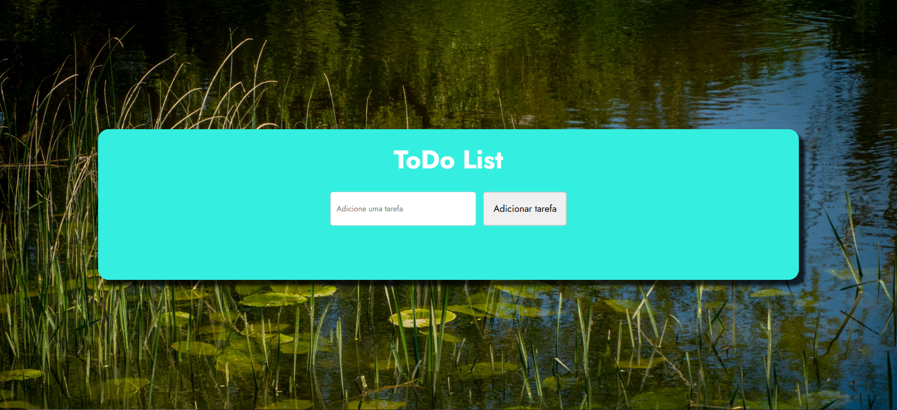

# Lista de Tarefas (Task List)
[](https://choosealicense.com/licenses/mit/)
## Preview



- Uma aplicação web moderna e responsiva para gerenciamento de tarefas, desenvolvida com HTML, CSS e JavaScript puro. O projeto oferece uma interface intuitiva para criar, editar, marcar como concluída e excluir tarefas.
## 🚀 Funcionalidades

- ✅ Adicionar Tarefas: Insira novas tarefas através de um campo de texto intuitivo
- 📝 Editar Tarefas: Modifique o conteúdo de tarefas existentes
- ✔️ Marcar Status: Alterne entre estados "Pendente" e "Concluído"
- 🗑️ Excluir Tarefas: Remova tarefas que não são mais necessárias
- 📱 Design Responsivo: Layout adaptável para diferentes tamanhos de tela
- 🎯 Layout em Grid: Visualização organizada com 3 tarefas por linha

## 💻 Tecnologias Utilizadas

- 
- 
- 


## 🎨 Características do Design

Layout moderno com grid responsivo
Esquema de cores suave e profissional
Fonte Jost para melhor legibilidade
Animações suaves nas interações
Interface minimalista e intuitiva

## 📱 Responsividade
- O layout se adapta automaticamente a diferentes tamanhos de tela:
# 
```
Desktop: 3 tarefas por linha
Tablet: 2 tarefas por linha
Mobile: 1 tarefa por linha
```
# 
```
📂 Estrutura do Projeto
ToDo-List/
│
├── index.html
├── css/
│   └── style.css
├── js/
│   └── script.js
├── imagePreview.png
└── README.md
```
## 🎯 Objetivo do Projeto
- O objetivo principal deste projeto é fornecer uma ferramenta simples e eficiente para gerenciamento de tarefas diárias. Com foco em:
```
Usabilidade intuitiva
Design limpo e moderno
Performance otimizada
Código limpo e bem estruturado
Experiência de usuário agradável
```
## ⚙️ Funcionalidades Detalhadas

- **Gerenciamento de Tarefas**
```
Adição: Interface simples com campo de texto e botão de adicionar
Edição: Botão dedicado que abre prompt para modificação
Status: Alternância entre estados com indicação visual clara
Exclusão: Remoção permanente com um clique
```
- **Interface**
```
Cabeçalho: Título claro e campo de entrada em destaque
Cards: Apresentação organizada das tarefas em grid
Botões: Ações claras e bem posicionadas
Estados: Diferenciação visual entre tarefas pendentes e concluídas
```
## 🔄 Fluxo de Trabalho

- **Criar Tarefa:**
```
Digite o texto da tarefa
Clique em "Adicionar" ou pressione Enter
A tarefa é adicionada com status "Pendente"
```

- **Gerenciar Tarefa:**
```
Edite o texto usando o botão "Editar"
Altere o status entre "Pendente" e "Concluído"
Exclua a tarefa quando necessário
```


## 🤝 Contribuição
- **Contribuições são sempre bem-vindas! Para contribuir:**

- Faça um Fork do projeto
- Crie uma Branch para sua Feature (git checkout -b feature/AmazingFeature)
- Commit suas mudanças (git commit -m 'Add some AmazingFeature')
- Push para a Branch (git push origin feature/AmazingFeature)
- Abra um Pull Request
